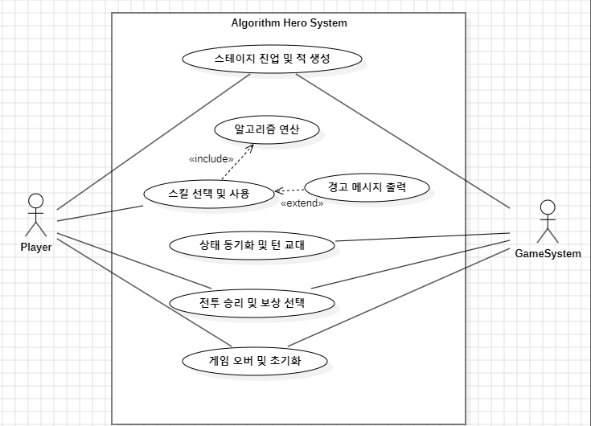
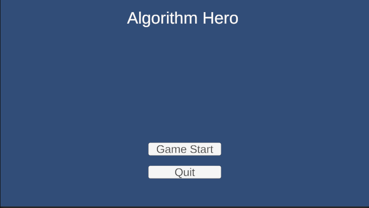
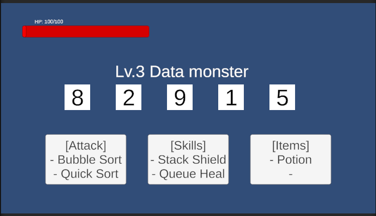
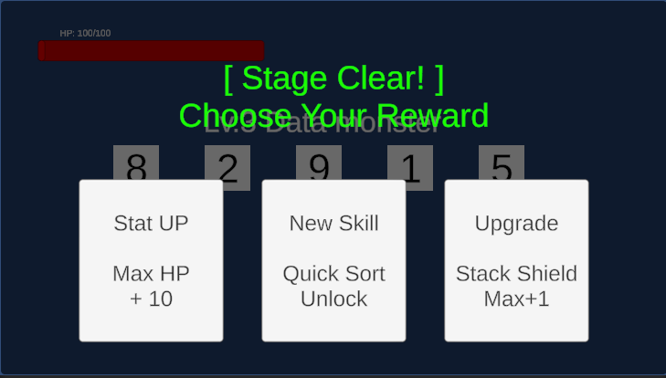

# 2. Analysis

**Project Title :** 알고리즘 용사 (가제)

**Student No :** 22212096

**Name :** 조의현

**E-mail :** 22212096@yu.ac.kr

## [ Revision history ]
| Revision data | Version # | Description | Author |

| 2026-05-01 | 0.01 | Analysis First Draft | 조의현 |

## = Contents =

1. Introduction
2. Use case analysis
3. Domain analysis
4. User Interface prototype
5. Glossary
6. References

---

## 1. Introduction

**1) Executive Summary**
본 프로젝트는 컴퓨터공학을 전공하며 필수적으로 거쳐야 하는 핵심 과목인 '자료구조와 알고리즘'을 텍스트와 코드만으로 파악하는 어려움을 해결하고자 기획된 "알고리즘 용사(가제)"의 분석(Analysis) 문서이다. 한 학기 내 개발이라는 제약 조건을 고려하여 복잡한 맵 탐색을 배제하고 단일 화면에서 연속적으로 전투가 이어지는 로그라이크(Roguelike) 방식을 채택했다. 플레이어는 '정렬되지 않은 무작위 데이터'를 적으로 마주하며, '정렬 알고리즘'과 '자료구조' 스킬을 사용하여 오름차순으로 정렬(격파) 한다. 본 문서를 통해 시스템의 상세한 유스케이스 시나리오, 도메인 클래스 구조, 그리고 UI 프로토타입을 구체화한다.

## 2) Use case analysis

## 2.1. Use Case diagram

### 2.2. Use Case Description

**Use Case #1: 스테이지 진입 및 적 생성**
| GENERAL CHARACTERISTICS | |
| :--- | :--- |
| **Summary** | 전투가 끝나는 즉시 다음 스테이지로 넘어가며, 난이도에 비례하여 무작위 데이터(적)를 생성하여 전투를 시작하는 기능 |
| **Scpoe**| 알고리즘 용사 (Algorithm Hero) |
| **Level** | System Level |
| **Author** | 조의현 |
| **Last Update** | 2026-05-01 |
| **Status | Analysis |
| **Primary Actor** | Game System |
| **Preconditions** | 게임을 처음 시작하거나, 이전 스테이지의 전투에서 승리하여 보상 획득을 완료해야 한다. |
| **Trigger** | 게임 시작 버튼을 누르거나, 보상 선택 팝업창이 닫혔을 때 |
| **Success Post Condition** | 새로운 난수 배열 데이터가 메모리에 적재되고 화면에 렌더링되며, 첫 턴이 시작된다. |
| **Failed Post Condition** | 메모리 부족 등의 에러로 데이터가 생성되지 않는다. |

| MAIN SUCCESS SCENARIO | |
| :--- | :--- |
| **Step** | **Action** |
| S | 게임 시작 혹은 다음 스테이지 진입 이벤트가 발생하면 시작한다.
| 1 | 시스템이 현재 스테이지 레벨을 확인하고 난이도에 맞는 배열 길이를 산출한다
| 2 | 무작위 숫자로 구성된 1차원 배열 데이터(적)를 생성한다. |
| 3 | 생성된 배열을 UI 블록 형태로 화면 중앙에 시각적으로 배치(렌더링)한다. |
| 4 | 이 Use case는 플레이어의 턴으로 상태 머신이 전환되며 성공적으로 끝난다. |

| EXTENSION SCENARIOS | |
| :--- | :--- |
| **Step** | **Branching Action** |
| 2 | 2a. 객체 풀링(Object Pooling) 큐에 남은 여유 블록 UI가 없는 경우 ...2a1. 새로운 블록 UI 객체를 동적으로 추가 생성하여 메모리에 할당한다.

| RELATED INFORMATION | |
| :--- | :--- |
| **Performace** | < 1 Second (데이터 생성 및 렌더링 시간) |
| **Frequency** | 매 스테이지 시작 시마다 |
| **Concurrency** | None |

 

**Use Case #2: 스킬(정렬/자료구조) 선택 및 사용**
| GENERAL CHARACTERISTICS | | 
| :--- | :--- |
| **Summary** | 플레이어가 턴마다 기본 공격인 '정렬 스킬'로 적 배열을 조작하거나 '자료구조 스킬'로 생존력을 높이는 기능 |
| **Scpoe**| 알고리즘 용사 (Algorithm Hero) |
| **Level** | User Level |
| **Author** | 조의현 |
| **Last Update** | 2026-05-01 |
| **Status | Analysis |
| **Primary Actor** | Player |
| **Preconditions** | 플레이어가 활성화된 스킬 버튼 중 하나를 마우스로 클릭할 때 |
| **Trigger** | 플레이어가 활성화된 스킬 버튼 중 하나를 마우스로 클릭할 때 |
| **Success Post Condition** | 선택한 스킬의 연산이 성공적으로 수행되어 배열이 정렬되거나 플레이어의 버프 상태가 갱신된다. |
| **Failed Post Condition** | 횟수 제한 등 제약 조건에 걸려 스킬이 발동되지 않는다. |

| MAIN SUCCESS SCENARIO | |
| :--- | :--- |
| **Step** | **Action** |
| S | 플레이어가 자신의 턴에 스킬을 사용하고자 할 때 시작된다. |
| 1 | 플레이어가 원하는 스킬 버튼(예: 병합 정렬)을 클릭한다. |
| 2 | 시스템은 해당 알고리즘/자료구조의 논리 연산을 내부 데이터에 1회 적용한다. |
| 3 | 연산 결과를 바탕으로 화면의 숫자 블록 UI의 위치를 애니메이션으로 부드럽게 이동시킨다. |
| 4 | 이 Use case는 데미지 산출 혹은 버프 적용이 완료되고 애니메이션이 끝나면 종료된다. |

| EXTENSION SCENARIOS | |
| :--- | :--- |
| **Step** | **Branching Action** |
| 1 | 1a. 퀵 정렬 등 사용 횟수 제한이 있는 스킬의 횟수를 모두 소모한 경우 ...1a1. 턴을 소모하지 않고 플레이어의 입력을 다시 대기한다.
| 2 | 2a. 병합 정렬을 사용했으나 이미 해당 구간이 정렬되어 있는 경우 ...2a1. 기믹에 의해 적 체력 반감 효과가 무효회되거나 데미지가 급감한다.

| RELATED INFORMATION | |
| :--- | :--- |
| **Performace** | < 0.1 Second (연산 시간 기준, 애니메이션 제외) |
| **Frequency** | 플레이어의 매 턴마다 (Frequent) |
| **Concurrency** | None |

 

**Use Case #3: 상태 동기화 및 턴 교대**
| GENERAL CHARACTERISTICS | |
| :--- | :--- |
| **Summary** | 현재 턴의 주체가 행동을 마치면 다음 주체로 턴을 넘기고 화면의 정보를 최신화하는 기능 |
| **Scpoe**| 알고리즘 용사 (Algorithm Hero) |
| **Level** | System Level |
| **Author** | 조의현 |
| **Last Update** | 2026-05-01 |
| **Status | Analysis |
| **Primary Actor** | Game System |
| **Preconditions** | 플레이어 혹은 적의 스킬 연산과 UI 시각화 애니메이션이 완전히 종료되어야 한다. |
| **Trigger** | 현재 턴 주체의 행동 로직이 모두 끝났을 때 |
| **Success Post Condition** | 체력바, 버프/디버프 상태가 최신화되고 턴 제어권이 다음 주체로 안전하게 넘어간다. |
| **Failed Post Condition** | 애니메이션 동기화 오류로 인해 턴이 넘어가지 않고 멈춘다. |

| MAIN SUCCESS SCENARIO | |
| :--- | :--- |
| **Step** | **Action** |
| S | 플레이어의 행동(스킬 사용)이 종료된 직후 시작된다. |
| 1 | 시스템이 남은 턴 수 및 플레이어/적의 현재 HP 수치를 갱신하여 UI에 동기화한다. |
| 2 | 상태 머신(State Machine) 패턴을 통해 '적의 턴'으로 상태를 전환한다. |
| 3 | 적이 무작위 패턴으로 플레이어에게 데미지를 가하고 플레이어의 HP 바를 깎는다. |
| 4 | 이 Use case는 적의 공격이 끝나고 다시 '플레이어의 턴'으로 상태가 넘어가며 종료된다. |

| EXTENSION SCENARIOS | |
| :--- | :--- |
| **Step** | **Branching Action** |
| 3 | 3a. 플레이어가 스택(LIFO) 방패 스킬 버프를 두르고 있는 경우 ...3a.1. 적의 데미지를 무효화하고 스택 버프를 1회 차감한다. |
| 3 | 3b. 적의 공격으로 플레이어의 체력이 0 이하가 될 경우 ...3b1. 턴 교대를 즉각 중지하고 **Use case #5 (게임 오버)**를 호출한다. |
| 1 | 1a. 플레이어의 공격으로 적 데이터가 100% 정렬(체력 0)된 경우 ...1a1. 턴 교대를 즉각 중지하고 ** Use case #4 (전투 승리)**를 호출한다. |

| RELATED INFORMATION | |
| :--- | :--- |
| **Performace** | < 2 Seconds (적의 공격 애니메이션 포함 시간) |
| **Frequency** | 매 턴 종료 시마다 |
| **Concurrency** | None |

 

**Use Case #4: 전투 승리 및 보상 선택**
| GENERAL CHARACTERISTICS | |
| :--- | :--- |
| **Summary** | 적을 완벽히 정렬하여 승리 시, 무작위 보상을 선택해 캐릭터를 강화하는 기능 |
| **Scpoe**| 알고리즘 용사 (Algorithm Hero) |
| **Level** | User Level |
| **Author** | 조의현 |
| **Last Update** | 2026-05-01 |
| **Status | Analysis |
| **Primary Actor** | Player |
| **Preconditions** | 적 데이터 배열이 100% 오름차순 정렬 상태(체력 0)가 되어야 한다. |
| **Trigger** | 턴 종료 시점 적의 체력이 0 이하로 떨어졌을 때 |
| **Success Post Condition** | 선택한 보상이 캐릭터 데이터에 덮어씌워지고 다음 스테이지로 넘어간다. |
| **Failed Post Condition** | 보상 선택 입력이 처리되지 않는다. |

| MAIN SUCCESS SCENARIO | |
| :--- | :--- |
| **Step** | **Action** |
| S | 적 체력이 0이 되어 전투가 종료되면 시작한다. |
| 1 | 시스템이 "Stage Clear!" 메시지를 띄우고 전투 루프를 중지한다. |
| 2 | 보상 매니저가 스킬 해금, 스탯 증가 등 3개의 무작위 선택지를 팝업 UI로 띄운다. |
| 3 | 플레이어가 3개의 보상 중 하나를 마우스로 클릭하여 선택한다. |
| 4 | 시스템이 플레이어 데이터에 선택된 보상을 반영하고 팝업창을 닫는다. |
| 5 | 이 Use case는 **Use case #1 (스테이지 진입)**을 다시 호출하며 성공적으로 끝난다. |

| EXTENSION SCENARIOS | |
| :--- | :--- |
| **Step** | **Branching Action** |
| 2 | 2a. 플레이어가 이미 모든 스킬을 해금한 상태일 경우 ...2a1. 스킬 해금 보상 대신 스탯 강화나 기존 스킬의 성능 향상(강화) 보상 위주로 출력한다. |

| RELATED INFORMATION | |
| :--- | :--- |
| **Performace** | < 1 Second (보상 팝업 생성 시간) |
| **Frequency** | 매 스테이지 클리어 시마다 |
| **Concurrency** | None |

 

**Use Case #5: 게임 오버 및 초기화**
| GENERAL CHARACTERISTICS | |
| :--- | :--- |
| **Summary** | 플레이어 체력이 0이 되면 결과를 출력하고 진행 상황을 초기화하는 로그라이크 코어 기능 |
| **Scpoe**| 알고리즘 용사 (Algorithm Hero) |
| **Level** | System Level |
| **Author** | 조의현 |
| **Last Update** | 2026-05-01 |
| **Status | Analysis |
| **Primary Actor** | Game System |
| **Preconditions** | 적의 공격으로 인해 플레이어의 HP가 0 이하가 되어야 한다. |
| **Trigger** | 플레이어가 HP가 0 이하로 떨어졌을 때 |
| **Success Post Condition** | 현재 씬의 진행 데이터가 모두 초기화되고 타이틀 화면으로 복귀한다. |
| **Failed Post Condition** | 진행도가 초기화되지 않는 버그가 발생한다. |

| MAIN SUCCESS SCENARIO | |
| :--- | :--- |
| **Step** | **Action** |
| S | 적의 공격 후 플레이어의 HP가 0 이하임을 감지하면 시작한다. |
| 1 | 시스템이 진행 중인 코루틴과 턴 로직을 즉각 중지한다. |
| 2 | 화면 전체에 반투명한 패널과 함께 게임 오버 UI를 렌더링한다. |
| 3 | 도달한 최고 스테이지 수 등 기록(결과)을 텍스트로 출력한다. |
| 4 | 플레이어가 확인(타이틀로 돌아가기) 버튼을 클릭한다. |
| 5 | 이 Use case는 획득한 모든 스킬과 스탯을 초기화하고 타이틀 씬을 로드하며 끝난다. |

| EXTENSION SCENARIOS | |
| :--- | :--- |
| **Step** | **Branching Action** |
| - | 별도의 예외 상황 없음 |

| RELATED INFORMATION | |
| :--- | :--- |
| **Performace** | < 3 Seconds (씬 전환 로딩 시간) |
| **Frequency** | 플레이어가 패배할 때마다 |
| **Concurrency** | None |

 

## 3. Domain analysis

본 시스템은 설계의 복잡도를 낮추고 유지보수를 용이하게 하기 위해 10개의 핵심 도메인 클래스(Class)로 분리하여 구성한다.

**1. 시스템 관리 (Managers)**
* `GameManager`: 게임의 전체 흐름(씬 전환, 스테이지 레벨 관리, 게임 오버 처리)을 통제하는 최상위 관리 클래스
* `BattleManager`: 전투 내에서 플레이어의 턴과 적의 턴을 번갈아 가며 실행하도록 제어하는 상태머신(State Machine) 역할의 클래스
* `UIManager`: 플레이어의 체력바, 남은 턴 수, 스킬 버튼 렌더링 및 전투 결과 팝업 등을 화면에 그려주고 갱신하는 시각화 제어 클래스

**2. 데이터 및 개체 (Entities)**
* `PlayerController`: 플레이어의 현재 스탯(HP, MP) 보유 중인 스킬 목록 등의 데이터를 저장, 관리하는 클래스
* `EnemyData`: 현재 스테이지에 등장한 적의 정보(무작위 난수 배열 데이터, 배열의 길이, 적의 남은 HP)를 담고 있는 구조체/데이터 클래스

**3. 핵심 로직 (Logic)**
* `ArrayVisualizer`: `EnemyData`의 내부 숫자 배열 정보를 참조하여, 화면 중앙에 실제 네모 블록 UI로 생성하고 정렬 시 이동 애니메이션을 처리하는 시각화 담당 클래스
* `RewardManager`: 전투 승리 시 보상 풀(Pool)에서 3개의 무작위 덱빌딩 선택지를 추출하고, 플레이어의 선택 결과를 시스템에 반영하는 클래스

**4. 스킬 시스템 (Skills - 상속 구조)**
* `SkillBase`: 모든 스킬이 공통으로 가져야 할 속성(스킬 이름, 쿨타임, 데미지 계수)을 정의하는 추상(Abstract) 부모 클래스
* `SortingSkill`: `SkillBase`를 상속받아, 실제 정렬 알고리즘(버블, 퀵, 병합) 로직을 연산하고 적 배열 상태를 오름차순에 가깝게 변경시키는 공격 스킬 구현 클래스
* `DataStructureSkill`: `SkillBase`를 상속받아, 스택(LIFO) 방어막이나 큐(FIFO) 회복 기믹을 활용하여 플레이어의 생존력을 높이는 유틸리티 스킬 구현 클래스

---

## 4. User Interface prototype

### 4.1. 

- **설명:** 플레이어가 게임을 처음 실행했을 때 진입하는 화면, 가운데에 "알고리즘 용사" 로고가 배치되며, 하단에 Game Start 및 Quit 버튼이 위치한다

### 4.2. 

- **설명:** 1인칭 단일 씬 시점. 화면 중앙에는 적을 상징하는 **`난수 숫자 블록 배열(예정)`**이 나열되어 있다. 좌측 상단에는 플레이어의 체력바가 있으며, 화면 하단 중앙에는 사용 가능한 **`스킬 카드 버튼(버블 정렬, 스택 방패 등)`**들이 덱빌딩 형태로 나열되어 클릭을 대기한다

### 4.3. 

- **설명:** 전투 승리 시 기존 전투 화면 위에 반투명한 패널로 팝업된다. 3장의 보상 카드 (ex: 최대 체력 +10, 퀵 정렬 획득, 병합 정렬 업그레이드 등) 중 하나를 마우스로 클릭하여 캐릭터 업그레이드를 진행한다.

---

## 5. Glossary

| Terms | Description |
| :--- | | :--- |
| **유니티 (Unity)** |  게임 클라이언트를 제작하기 위한 상용 게임 엔진 도구 |

| **정렬 알고리즘 (Sorting Algorithm)** | 원소들을 번호순이나 사전 순서와 같이 일정한 순서대로 열거하는 알고리즘 (ex : Bubble, Quick, Merge 등) |

| **시간 복잡도 (Time Complexity)** | 특정 알고리즘이 문제를 해결하는 데 걸리는 시간(연산 횟수)을 수학적으로 표기한 것 |

| **로그라이크 (Roguelike)** | 게임 오버 시 모든 진행 상황이 초기화되며, 매 플레이마다 무작위 보상을 통해 새롭게 캐릭터를 육성해 나가는 게임 장르적 특징 |

| **LIFO(Last-In-First-Out)** | 나중에 넣은 데이터가 먼저 나오는 스택(Stack)의 원리, 가장 최근의 공격을 방어/무효화하는 스킬 컨셉으로 쓰일 예정 |

| **FIFO(First-In-First-Out)** | 먼저 넣은 데이터가 먼저 빠져나오는 큐(Queue)의 원리, 순차적으로 체력을 채워주는 회복 스킬 등의 컨셉으로 쓰일 예정 |

| **오브젝트 풀링 (Object Pooling)** | 자주 생성/파괴되는 오브젝트를 미리 만들어 보관해 두고 재사용하여 메모리 낭비와 프레임 저하를 막는 최적화 기법 |

| **코루틴 (Coroutine)** | 실행을 일시 정지했다가 지정된 시간 이후에 이어서 실행할 수 있도록 해주는 유니티의 기능으로, 애니메이션 연출이나 턴 제어에 주로 사용 |

| **상태 머신(State Machine)** | 시스템이 가질 수 있는 여러 '상태(State)'들을 정의하고, 조건에 따라 한 상태에서 다른 상태로 전이되도록 제어하는 설계 패턴 (본 게임에서는 '플레이어 턴', '적 턴' 등이 겹치지 않고 순차적으로 실행되도록 관리하는 데 쓰일 예정 |

| **덱빌딩 (Deckbuilding)** | 무작위 선택지 중 자신에게 필요한 스킬이나 아이템을 골자 최적의 조합을 만들어 나가는 게임 시스템 |

| **기믹 (Gimick)** | 각 정렬 알고리즘이 가진 고유의 수학적 특성을 전투에 맞게 변형한 특별한 규칙 |

| **턴 로직(Turn Logic)** | 하나의 턴 내부에서 순차적으로 발생하는 데이터 처리 흐름. 스킬 입력, 데미지 연산, UI 애니메이션 재생, 상태 동기화 등 모두 완료되어야 다음 턴으로 넘어가도록 구성 |

| **씬 (Scene)** | 유니티 엔진에서 게임의 한 화면이나 스테이지, 타이틀 메뉴 등을 구성하는 공간적 기본 단위. 본 기획에서는 로딩 지연을 막기 위해 화면 전환 없이 하나의 씬 (단일 씬)에서 데이터를 교체하며 전투를 진행할 예정 |

| **비기능적 요구사항 (NFR)** | 시스템이 제공하는 핵심 기능 외의 성능, 보안, 사용성 등 시스템의 품질을 결정하는 요구사항 |

---

## 6. References
1. Unity Documentation: https://docs.unity.com/
2. Toptal Sorting Algorithms (각 정렬 특성 참고): https://www.toptal.com/developers/sorting-algorithms
3. 위키백과 - 시간 복잡도: https://ko.wikipedia.org/wiki/시간_복잡도
4. NesHacker (Youtube) - "How NES Games Use State Machines For Everything": https://www.youtube.com/watch?v=8lZ53Sx5oc0
5. VisuAlgo (정렬 알고리즘 UI 시각화 연출 참고): https://visualgo.net/ko/sorting
