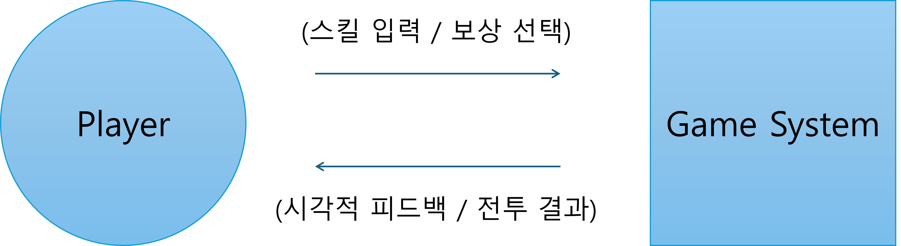

# 1. Conceptualization

**Project Title :** 알고리즘 용사 (가제)
**Student No :** 22212096
**Name :** 조의현
**E-mail :** 22212096

## [ Revision history ]
| Revision data | Version # | Description | Author |
| 2026-03-24 | 0.01 | First Draft | 조의현 |

## = Contents =

1. Business purpose
2. System context diagram
3. Use case list
4. Concept of operation
5. Problem statement
6. Glossary
7. References

---

## 1. Business purpose

**1) Project background**
컴퓨터공학을 전공하며 자료구조와 알고리즘은 필수적으로 거쳐야 하는 핵심 과목이지만, 많은 학생들이 텍스트와 코드만으로 원리를 파악하는 데 어려움을 느낀다. 이를 쉽게 접근하고 이해할 수 있도록 하기 위해 게임이라는 시각적이고 직관적인 매체를 활용하기로 하였다.
특히 플레이어의 전략적인 선택이 턴마다 실시간으로 반영되는 턴제 RPG 장르는 알고리즘의 단계적 실행 과정을 표현하기에 적절하다고 생각한다. 한 학기 안에 개발해야 하기에 복잡한 맵 탐색 같은 부분을 배제하고 단일 화면에서 연속적으로 전투가 이어지는 로그라이크(Roguelike) 방식을 채택하여, 정렬되지 않은 데이터를 '적'으로 설정하고 플레이어가 '정렬 알고리즘'과 '자료구조' 스킬을 사용하여 이를 격파하는 전투 시스템을 기획하였다.

**2) Goal**
유니티(Unity) 엔진을 사용하여 로그라이크 요소가 가미된 단일 화면 기반의 자료구조/알고리즘 턴제 RPG  시스템을 구현한다.
정렬 알고리즘(버블, 퀵, 병합 등)과 자료구조(스택, 큐)의 논리적 특성을 전투 스킬의 데미지, 기믹, 쿨타임 등으로 치환하여 명확한 규칙을 가진 전투 환경을 제현한다.

**3) Target Market**
- 자료구조/알고리즘의 동작 원리를 직관적이고 흥미롭게 학습하거나 확인하고 싶은 전공생 및 일반인
- 전략적 수싸움(덱빌딩)과 퍼즐 요소가 가미된 로그라이크 턴제 RPG를 선호하는 게이머

---

## 2. System context diagram

[Player] -- (스킬 입력 / 보상 선택) -> [Game System]

[Player] <- (시각적 피드백 / 전투 결과) -- [Game System]

---

## 3. Use case list

| Actor | Description |

**1) 전투 진입 및 적 생성**

| (Player, Game System) | 전투가 끝나는 즉시 다음 스테이지로 넘어가며, 시스템은 스테이지 레벨 비례하여 더 길고 복잡한 '무작위 데이터(적)'를 생성하여 전투를 시작한다. |
**2) 스킬(정렬/자료구조) 선택 및 사용**

|(Player, Game System) | 플레이어는 턴마다 기본 공격인 '정렬 스킬'로 적 데이터를 정렬해 타격을 주거나, 보상으로 획득한 '자료구조 스킬(스택 방패, 큐 회복 등)'을 사용하여 생존력 을 높인다. |
 
**3) 상태 동기화 및 턴 교대**

|(Game System) | 플레이어의 턴이 종료되는 순간 적의 공격 턴이 진행되며, 데이터의 정렬 상태, 체력(HP), 턴 수 변화를 UI에 실시간(Real-time)으로 반영한다. |

**4) 전투 승리 및 보상 선택**

|(Player, Game System) | 데이터가 완벽히 오름차순으로 정렬(적 체력0)되면 승리하며, 팝업 UI를 통하여 무작위 보상(새로운 스킬, 스킬 강화, 스탯 증가 등) 중 하나를 선택해 본인의 캐릭터를 강화한다. |

**5) 게임 오버 및 초기화**

|(Game System) | 플레이어의 체력이 0이 되면 진행 상황을 결과 창에 출력하고, 모든 스킬과 스테이지 진행도를 초기화하여 로그라이크 특성을 살린다. |

---

## 4. Concept of operation

### 1) 전투 진입 및 적 생성

| Purpose | 끊김 없는 연속적 턴제 전투 환경(로그라이크 덱빌딩 스타일) 제공 |
| Approach | 맵 이동 없는 단일 씬(Scene) 내에서 적 데이터만 교체한다. 스테이지 레벨이 오를수록 생성되는 데이터의 길이 증가시키거나 형태를 바꿔 난이도를 높인다. |
| Dynamics | 게임 시작 버튼을 누르거나, 이전 스테이지를 클리어한 직후 |
| Goals | 불필요한 탐색 요소를 배제하고 즉각적인 전투 돌입 구현 |

### 2) 스킬(정렬/자료구조) 선택 및 사용

| Purpose | 알고리즘 특성을 활용한 기믹 기반의 딜링 및 방어 매커니즘 구현|
| Approach | 정렬 특성을 스킬 기믹으로 구현한다. '버블 정렬'은 데미지는 낮지만 패널티 없는 기본 공격으로 사용. '병합 정렬'은 분할 정복 특성을 살려 적 체력을 반감시키되, 이미 부분 정렬된 배열에는 효과가 급감하도록 설정. '퀵 정렬'은 강력하지만 횟수 제한(ex: 최대 3회)가 존재하도록 설정. 또한 스택(LIFO)의 원리를 이용해 가장 치명적인 공격을 방어하거나, 큐(FIFO)를 이용하여 순차 회복을 하는 방어/유틸 스킬을 활용한다.|
| Dynamics | 플레이어 턴에 공격 스킬 또는 방어/회복 스킬 버튼을 클릭 했을 경우|
| Goals | 각 알고리즘과 자료구조의 고유한 원리를 전투의 전략적 형태로 체감|

### 3) 상태 동기화 및 턴 교대

| Purpose | 턴제 RPG의 핵심인 턴 흐름 제어 및 정보 시각화|
| Approach | 플레이어의 턴 로직(UI 애니메이션 및 데미지 계산)이 완전히 종료된 후 적의 턴을 싱행하는 상태 머신(State Machine) 패턴을 적용하여 데이터 꼬임을 방지한다.|
| Dynamics | 턴이 진행되어 캐릭터들의 상태 수치 및 데이터 형태에 변화가 발생하는 경우|
| Goals | 안정적이고 명확한 전투 피드백을 통하여 플레이어에게 몰입감을 제공|

### 4) 전투 승리 및 보상 선택

| Purpose | 로그라이크 요소의 핵심인 '덱빌딩(스킬 조합)과 성장'의 재미 부여|
| Approach | 적 데이터가 100% 정렬되면 보상 매니저를 호출하여 3개의 선택지를 제공한다. 보상은 상위 스킬 해금뿐만 아니라 기존 스킬의 '성능 개선(ex : 병합 정렬 업그레이드시, 기정렬된 상태면 플레이어에게 추가 턴 부여)' 요소가 등장한다.|
| Dynamics | 적의 HP가 0이 되어 전투가 종료된 경우|
| Goals | 플레이어의 입맛에 맞는 스킬 조합을 완성해 나가는 다회차 플레이 동기 강화|

### 5) 게임 오버 및 초기화

| Purpose | 로그라이크 장르의 특징인 '진행도 초기화'를 통해 게임의 긴장감 및 리플레이성(반복 플레이) 부여
| Approach | 플레이어의 HP가 0 이하로 떨어지면 진행 중인 턴 로직을 즉각 중지하고 게임 오버 UI를 렌더링한다. 결과 창(도달한 스테이지 등) 확인 후, 플레이어가 획득한 모든 스킬과 스탯, 진행 데이터를 완전히 초기화하고 첫 스테이지로 되돌린다.
| Dynamics | 적의 공격으로 인해 플레이어의 HP가 0이 되어 전투 패배 조건이 달성된 경우
| Goals | 플레이어에게 전투의 긴장감을 제공하며, 실패 시 매번 새로운 스킬 조합(덱빌딩)을 시도하도록 유도

---

## 5. Problem statement

**[Overview]**

본 프로젝트는 유니티 기반의 크로스 플랫폼을 염두에 두고 단일 화면 기반의 로그라이크 턴제 RPG를 개발한다. 규모를 최소한으로 줄였음에도 기획 및 기술적인 여러 문제에 직면할 것으로 예상된다.

**Problem #1 - 알고리즘 효율성 간의 게임 밸런스 붕괴**

버블 정렬[$O(N^2)$]과 퀵 정렬[$O(N \log N)$]을 단순히 데미지로만 치환하면, 효율이 좋은 스킬만 남발하는 밸런스 붕괴 현상이 발생한다. 이를 방지하기 위해 퀵 정렬에 '최대 5회 사용 제한' 같은 페널티를 주거나, 상대의 '정렬 상태'에 따라 데미지가 달라지는 기믹(병합 정렬)을 추가한다. 또한 보상을 통한 '정렬 기능 개선' 시스템을 도입하여 하위 스킬도 버려지지 않고 콤보나 시너지 용도로 쓰이게끔 설계해야 한다.

**Problem #2 - 무한 반복 루프에서의 메모리 누수**

연속 전투 루프 방식으로 스테이지가 끊임없이 반복되기 때문에, 생성된 데이터의 UI나 이펙트 오브젝트를 제때 메모리에서 해제하지 않으면 게임 프레임이 저하될 것이다. 이를 해결하기 위해 오브젝트 풀링(Object Pooling) 기법의 적극적인 도입이 필요하다.

**Problem #3 - 연산과 렌더링 로직의 비동기화**

정렬 알고리즘의 내부 코드 실행 속도와 화면에서 데이터가 움직이는 애니메이션 속도 사이의 간극을 조율해야 한다. 로직과 UI가 비동기화되어 애니메이션 도중 턴이 넘어가지 않도록 코루틴(Coroutine)을 활용한 엄격한 제어가 필요하다.

**Problem #4 - 현실의 알고리즘 성능과 게임적 허용 (Gameplay Allowance) 간의 괴리**

알고리즘/자료구조의 절대적인 현실 성능을 게임에 100% 동일하게 적용할 수는 없다. 예를 들면, 버블 정렬은 현실의 실무에서 기피되는 최악의 정렬이지만, 게임에서는 레벨 디자인상 초반 생존을 위해 필수적으로 사용되어야 한다. 이처럼 현실의 효율성과 게임 내의 밸런스가 충돌할 때 단순히 게임을 즐기는 일반인이라면 크게 상관이 없을 수 있지만 전문지식이 있는 전공자 플레이어는 "현실의 코드 성능과 다르다"는 괴리감을 느낄 수 있다. 이를 해결하기 위해 완벽한 교육적 고증보다는 게임으로서의 '재미'와 '레벨 디자인'을 최우선적으로 두는 기획적 타협이 필요하고, 튜토리얼이나 게임 내 설정을 통해 이것이 '알고리즘 원리'를 재해석한 '게임'임을 자연스럽게 인지시켜야 한다.

**NFRs (Non-Functional Requirements)**

1. 게임 엔진은 유니티(Unity)를 사용하며 기본 언어는 유니티의 스크립팅 언어인 C#을 채택한다.
2. 전투 시 정렬 알고리즘 시각화 애니메이션은 몰입을 깨지 않도록 신속하게 처리되어야 한다.
3. 데이터의 크기가 커지더라도 연산 중 게임 클라이언트의 프레임이 60fps 아래로 저하되지 않아야 한다.

---

## 6. Glossary

| Terms | Description |

| **유니티 (Unity)** |  게임 클라이언트를 제작하기 위한 상용 게임 엔진 도구 |

| **정렬 알고리즘 (Sorting Algorithm)** | 원소들을 번호순이나 사전 순서와 같이 일정한 순서대로 열거하는 알고리즘 (ex : Bubble, Quick, Merge 등) |

| **시간 복잡도 (Time Complexity)** | 특정 알고리즘이 문제를 해결하는 데 걸리는 시간(연산 횟수)을 수학적으로 표기한 것 |

| **로그라이크 (Roguelike)** | 게임 오버 시 모든 진행 상황이 초기화되며, 매 플레이마다 무작위 보상을 통해 새롭게 캐릭터를 육성해 나가는 게임 장르적 특징 |

| **LIFO(Last-In-First-Out)** | 나중에 넣은 데이터가 먼저 나오는 스택(Stack)의 원리, 가장 최근의 공격을 방어/무효화하는 스킬 컨셉으로 쓰일 예정 |

| **FIFO(First-In-First-Out)** | 먼저 넣은 데이터가 먼저 빠져나오는 큐(Queue)의 원리, 순차적으로 체력을 채워주는 회복 스킬 등의 컨셉으로 쓰일 예정 |

| **오브젝트 풀링 (Object Pooling)** | 자주 생성/파괴되는 오브젝트를 미리 만들어 보관해 두고 재사용하여 메모리 낭비와 프레임 저하를 막는 최적화 기법 |

| **코루틴 (Coroutine)** | 실행을 일시 정지했다가 지정된 시간 이후에 이어서 실행할 수 있도록 해주는 유니티의 기능으로, 애니메이션 연출이나 턴 제어에 주로 사용 |

| **상태 머신(State Machine)** | 시스템이 가질 수 있는 여러 '상태(State)'들을 정의하고, 조건에 따라 한 상태에서 다른 상태로 전이되도록 제어하는 설계 패턴 (본 게임에서는 '플레이어 턴', '적 턴' 등이 겹치지 않고 순차적으로 실행되도록 관리하는 데 쓰일 예정 |

| **턴 로직(Turn Logic)** | 하나의 턴 내부에서 순차적으로 발생하는 데이터 처리 흐름. 스킬 입력, 데미지 연산, UI 애니메이션 재생, 상태 동기화 등 모두 완료되어야 다음 턴으로 넘어가도록 구성 |

| **씬 (Scene)** | 유니티 엔진에서 게임의 한 화면이나 스테이지, 타이틀 메뉴 등을 구성하는 공간적 기본 단위. 본 기획에서는 로딩 지연을 막기 위해 화면 전환 없이 하나의 씬 (단일 씬)에서 데이터를 교체하며 전투를 진행할 예정 |

| **비기능적 요구사항 (NFR)** | 시스템이 제공하는 핵심 기능 외의 성능, 보안, 사용성 등 시스템의 품질을 결정하는 요구사항 |

---

## 7. References
1. Unity Documentation : https://docs.unity.com/
2. 각 정렬 특성 참고 : https://www.toptal.com/developers/sorting-algorithms
3. 시간 복잡도 참고 : https://ko.wikipedia.org/wiki/시간_복잡도
4. 상태 머신 설계 패턴 참고 : https://www.youtube.com/watch?v=8lZ53Sx5oc0
5. 정렬 알고리즘 UI 시각화 연출 참고 : https://visualgo.net/ko/sorting
