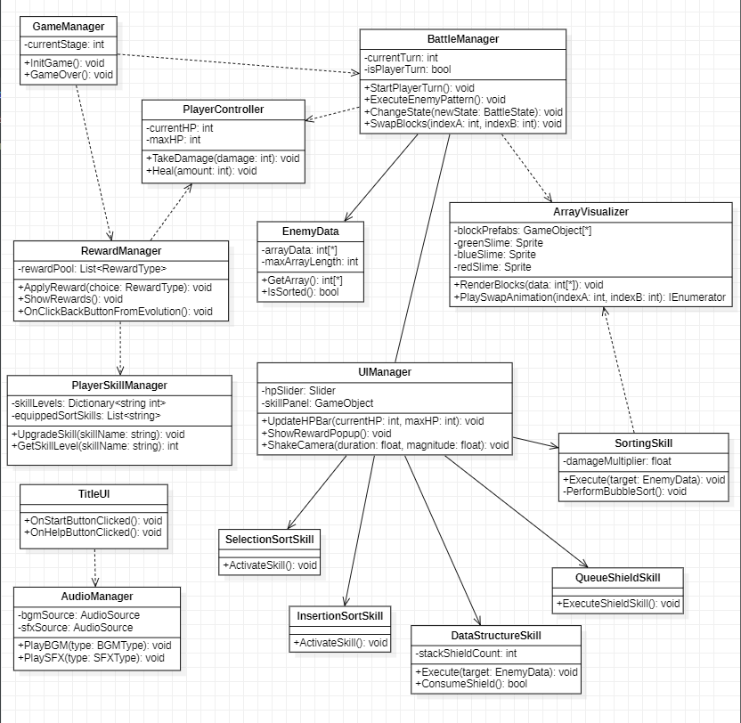
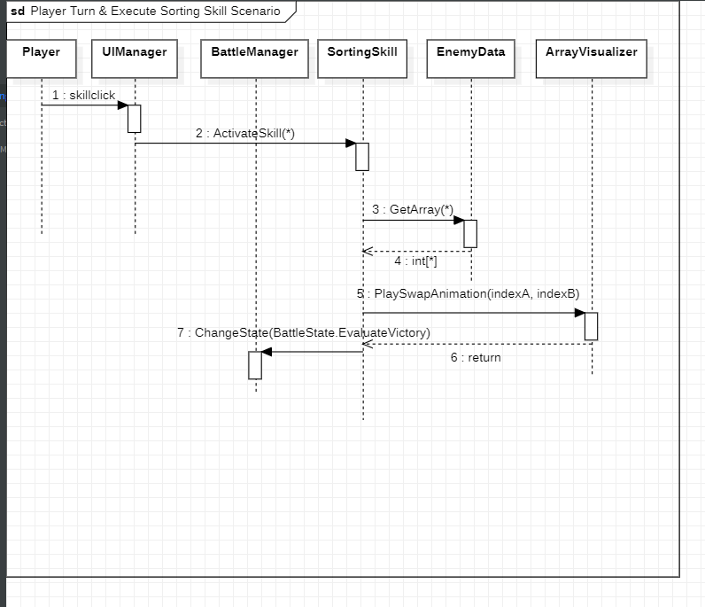
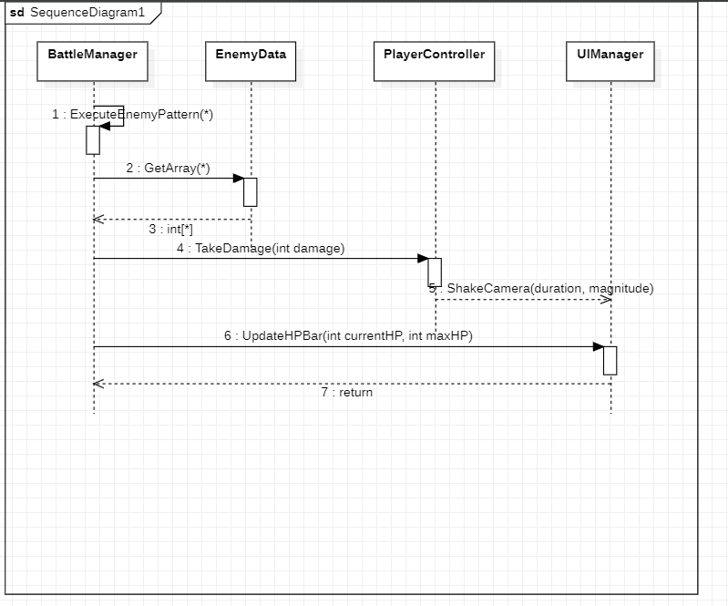
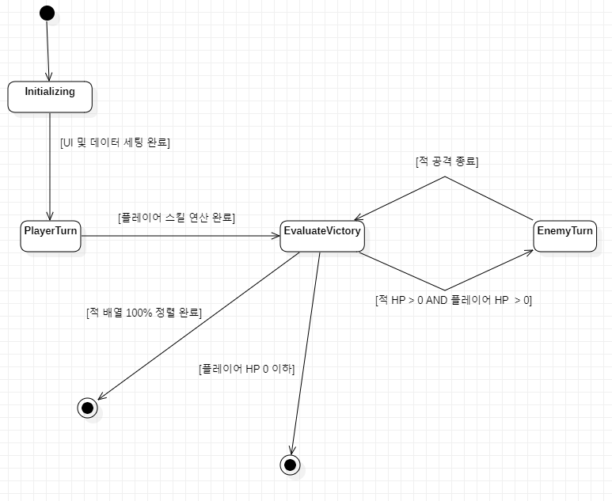

# 3. Design

**Project Title :** 알고리즘 용사 (가제)

**Student No :** 22212096

**Name :** 조의현

**E-mail :** 22212096@yu.ac.kr

**GitHub Repository :** https://github.com/Ydin-ee/SoftwareDesign_22212096

## [ Revision history ]
| Revision data | Version # | Description | Author |
| :--- | :--- | :--- | :--- |
| 2026-05-26 | 0.01 | Design First Documentation | 조의현 |
| 2026-06-10 | 0.02 | Design Second Documentation | 조의현 |

## = Contents =

1. Introduction
2. Class diagram
3. Sequence diagram
4. State machine diagram
5. Implementation requirements
6. Glossary
7. References

---

## 1. Introduction

**1) Summary**
본 문서는 "알고리즘 용사(가제)" 개발 프로세스의 세 번째 단계인 디자인(Design) 명세서. 앞서 수행한 유스케이스 및 도메인 분석(Analysis) 결과를 바탕으로, 실제 유니티(Unity) 엔진 및 C# 환경에서 객체지향 프로그래밍(OOP) 구현이 가능하도록 구체적인 소프트웨어 설계 도면을 제시.

**2) Design Focus**
 - **상세 클래스 설계:** 도메인 분석에서 도출된 10개 내외의 핵심 모듈을 바탕으로 접근 제어자(+, -), 속성(Attribute)의 데이터 타입, 연산(Operation)의 매개변수 및 반환 타입을 확정하여 복잡성을 최소화.
- **동적 행위 모델링:** 게임의 핵심인 '전투(턴 로직)' 과정에서 객체 간에 시간 흐름에 따라 주고받는 메시지 스트림을 구체화하고, 핵심 매니저의 상태 전이를 명확히 시각화하여 논리적 오류를 사전에 방지.

---

## 2. Class diagram

C# 및 유니티 환경의 클래스 설계 원칙(단일 책임 원칙, 정보 은닉 등)에 맞추어 설계된 상세 클래스 다이어그램.

### 2.1. Class Specifications

1. **GameManager (최상위 제어)**
	- 멤버 변수 및 함수들이 표준 명명 규칙을 따르며, 게임 씬 전환 및 세션 초기화를 전담한다.
2. **BattleManager (전투 상태 제어)**
	- 턴제 전투의 흐름을 통제하며, 플레이어와 적 간의 유기적인 연산을 연계한다.
3. **ArrayVisualizer (데이터 시각화)**
	- 적이 가진 난수 배열 정보를 참조하여 화면에 UI 블록을 동적으로 배치하고, 정렬 연산 시 이동 애니메이션을 제어한다. 스테이지 변화에 맞춰 뒤에 배치되는 적(슬라임)의 스프라이트 이미지 교체 로직도 통합하여 수행한다.
4. **UIManager (UI 제어 및 시각 연출)**
	- 플레이어의 체력바, 스킬 팝업 등을 제어하며, 단일화된 통제를 위해 카메라 흔들림(Camera Shake) 등의 화면 시각 연출 기능도 흡수하여 관리한다.
5. **개별 스킬 클래스 (SortingSkill, DataStructureSKill 등)**
	- 불필요한 상속 구조를 제거하여 복잡성을 낮추고, 각 스킬(버블, 선택, 삽입 정렬 및 스택/큐 쉴드)이 독립적인 컴포넌트로 동작하도록 구현하여 시스템의 안정성을 확보한다.

---

## 3. Sequence diagram

시스템 내부 객체들이 시간의 흐름에 따라 상호작용하는 과정을 나타낸 순서 다이어그램. 게임 루프에서 가장 중요한 핵심 시나리오들을 명세.

### 3.1 Player Turn & Execute Sorting Skill Scenario (플레이어 턴 및 정렬 공격 시나리오)
플레이어가 하단 UI 메뉴에서 정렬 스킬을 클릭했을 때, 데이터 연산이 일어나고 화면에 시각화되는 일련의 상호작용 흐름이다.

### 3.2 Enemy Turn & State Update Scenario (적 턴 및 플레이어 피해 시나리오)
플레이어의 행동이 끝나고 적의 공격 턴이 개시되어 플레이어의 데이터 상태(HP)가 차감되고 UI가 동기화되는 흐름이다.

---

## 4. State machine diagram

시스템 내부에서 상태 변화가 가장 활발하고 정밀하게 통제되는 'BattleManager'의 생명주기(Lifetime) 동안의 상태 전이 다이어그램.

 - **Idle / Initializing:** 스테이지 레벨에 따른 적의 무작위 숫자 배열 데이터를 생성하고 UI 블록을 씬에 배치하는 대기 상태.
 - **PlayerTurn:** 플레이어의 입력(커맨드 선택)을 기다리는 상태. 스킬 선택 시 알고리즘 연산 및 애니메이션 연출 상태로 전이.
 - **EnemyTurn:** 플레이어의 상태 이상 및 방어막 버프 등을 계산한 뒤, 적의 무작위 패턴 공격 연산을 수행하는 상태.
 - **EvaluateVictory:** 매 행동 종료 시점에 적 배열의 100% 오름차순 정렬 여부 (적 HP 0 이하) 또는 플레이어의 HP 0 이하 여부를 검사하여 승리(Reward) 및 패배(GameOver) 상태로 분기하는 상태.

---

## 5. Implementation requirements

본 시스템을 실제 빌드하고 구현하기 위해 필요한 하드웨어 및 소프트웨어 개발 환경 요구사항.

### 5.1 S/W Platform Requirements
 - **Game Engine:** Unity 2022.3 LTS 이상
 - **Scripting Language / IDE:** C# (.NET Standard 2.1) / Visual Studio 2022
 - **Version Control:** Git & GitHub Desktop
 - **Target OS:** PC (Windows 10/11)

### 5.2 H/W Platform Requirements
 - **Development & Target PC:** Intel Core i3 / AMD Ryzen 3 이상
 - **Memory (RAM):** 8GB 이상
 - **Graphics:** DirectX 11을 지원하는 내장 또는 외장 그래픽
 - **Input Device:** 마우스 (UI 클릭 인터랙션 중심 설계)

---

## 6. Glossary
| Terms | Description|
| :--- | :--- |
| **접근 제어자 (Access Modifier)** | 클래스 내부 멤버의 공개 범위를 지정하는 키워드, 정보 은닉을 위해 속성은 private(-), 연산은 public(+)을 원칙으로 한다. |
| **다중성 (Multiplicity)** | 클래스 다이어그램에서 한 클래스의 인스턴스가 다른 클래스의 인스턴스 몇 개와 연결될 수 있는지를 나타내는 제약 조건 (예: 1, *) |

## 7. References
1. Unity 유니티 인터랙티브 UI 가이드라인 및 프리팹 최적화 문서: https://docs.unity3d.com/Packages/com.unity.ugui@2.6/manual/index.html
2. Nic Barker (2023). "Intro to Data Oriented Design for Games" YouTube (시스템 'EnemyData' 배열 연산 최적화 및 구조체(Struct) 설계 패러다임 참고): https://www.youtube.com/watch?v=WwkuAqObplU
